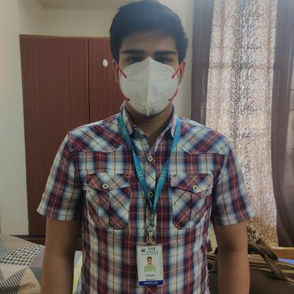
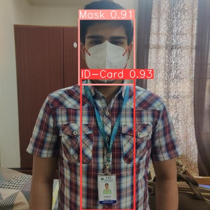

# ID-Card Detection REST API

This Flask REST API application is designed to detect ID-card and Mask from images.

## Setup and Installation

### Prerequisites
- Python 3.8 or higher
- Docker

### Local Setup

1. Clone this repository:
    ```bash
    git clone git@github.com:bangarisaiswaraj/id-n-mask-detection.git
    ```

2. Navigate to the project directory:
    ```bash
    cd id-n-mask-detection
    ```

3. Create .env file using .env.sample and update as required
    ```bash
    cp .env.sample .env
    ```

4. Set up a virtual environment (recommended):
    ```bash
    python3 -m venv .venv
    source .venv/bin/activate  # On Windows, use venv\Scripts\activate
    ```

5. Install dependencies:
    ```bash
    pip install -r requirements.txt
    ```

## Running the Application
### Locally

1. Activate the virtual environment (if not already activated):
    ```bash
    source venv/bin/activate  # On Windows, use venv\Scripts\activate
    ```

2. Start the server:
    ```bash
    python app.py
    ```

### Using Docker

1. Build the Docker image
    ```bash
    docker build . -t id-card-detection:latest
    ```

2. Run the Docker container
    ```bash
    docker run --env-file=.env --publish=5000:5000 --name=id-card-detection id-card-detection:latest
    ```

## API Endpoints

### GET /

```bash
$ curl --location 'http://localhost:5000'
```

```bash
This app is for ID Card and Mask detection.
```

### POST /api/id-card-detection/process-image
```bash
curl --location 'http://localhost:5000/api/id-card-detection/process-image' --form 'file=@"/Users/bangari.swaraj/Work/CV/images/ID Detection/IMG-20220810-WA0164_jpg.rf.9ddf26e0e9cbe22e11947513aeb9204b.jpg"'
```

```json
{
    "image_url": "http://localhost:5000/api/image/IMG-20220810-WA0164_jpg.rf.9ddf26e0e9cbe22e11947513aeb9204b.jpg",
    "message": "Image processed successfully.",
    "success": true
}
```

## Output

<table>
  <tr>
    <td align="center">Input Image</td>
     <td align="center">Output Image</td>
  </tr>
  <tr>
    <td></td>
    <td></td>
  </tr>
 </table>
